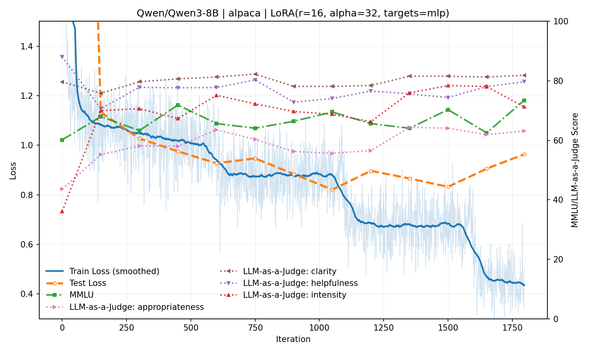

# Shakespeare-LoRA

A project exploring parameter-efficient fine-tuning and LLM-as-a-judge evaluation for style transfer. We use LoRA to fine-tune Qwen3-8B on a synthetically modified Alpaca dataset with Shakespearean style. See [report.md](report.md) for detailed results.
<p></p>

## Quick Start

1) Install dependencies:
```bash
git clone https://github.com/zxsimon/shakespeare-lora.git
conda create -n shakespeare-lora python=3.10 -y
conda activate shakespeare-lora
pip install -e .
```

2) Chat (uses the included `alpaca-mlp-16-32_1796` checkpoint)

```bash
chat-lora
```

3) Sweep (runs multiple training jobs from a config)

```bash
sweep-lora                              # uses configs/settings.jsonl
sweep-lora --config settings-llmjudge  # requires judge model at 127.0.0.1:1234
```

## Results
Detailed setup, results, and discussions are available in [report.md](report.md).

### TL;DR
- LoRA achieves Shakespearean style transfer while retaining general capabilities, though responses become less verbose and helpful.
- Layer selection matters more than rank: rank 16 is a strong default. MLP-only performs better than attention-only; all-layers does not provide significant incremental improvements over MLP-only.
- LLM-as-a-Judge is useful but difficult to implement reliably.

### Single run plot (mlp-only r=16 α=32)
<p></p>

## Reproduction

Standard run (Qwen3-8B, LoRA attn r=16 α=32):

```bash
python -m scripts.train \
  --model Qwen/Qwen3-8B --dataset alpaca \
  --lora_target_modules attn --lora_r 16 --lora_alpha 32 \
  --batch_size 8 --mini_batch_size 2 --epochs 3 \
  --max_train_iters 5000 --eval_interval 150 \
  --generate_interval 300 --model_checkpoint_interval 500 --llmjudge
```

- Checkpoints: `checkpoints/{dataset}-{target}-{r}-{alpha}_{iter}` (e.g., `checkpoints/alpaca-attn-16-32_1500`).
- Quick test: add `--testing`. Device selection is automatic (cuda > mps > cpu).
- LLM-judge requires a model at `127.0.0.1:1234` (see `eval/llmjudge.py`).
- Reproduce all runs:

```bash
python -m scripts.sweep --config settings-llmjudge
```